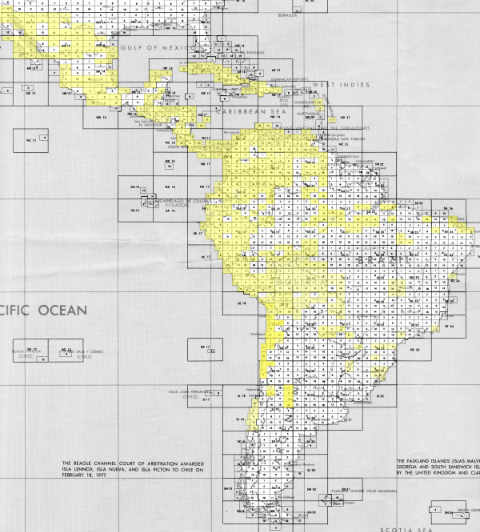

---
# You don't need to edit this file, it's empty on purpose.
# Edit theme's home layout instead if you wanna make some changes
# See: https://jekyllrb.com/docs/themes/#overriding-theme-defaults
layout: home
---

<div class="jumbotron">
  <h1 class="display-4">OpenIndexMaps</h1>
  <p class="lead">A community and format for sharing <a href="https://en.wikipedia.org/wiki/Index_map">index maps</a>.</p>
  <!-- <hr class="my-4">
  <p>A new GeoJSON-based file specification for standardizing spatial index map creation has been released. For more information see the latest specification documentation.</p>
  <p class="lead">
    <a class="btn btn-primary btn-lg" href="/v1" role="button">Latest Specification</a>
  </p> -->
</div>



OpenIndexMaps use the [GeoJSON Format](https://tools.ietf.org/html/rfc7946) to deliver information about an index map that references maps or other index maps. The concept of web-based index maps is not novel, however with many differing implementations, a common community-based standard was needed.

# Specification

- 1\. Introduction
  - 1.1 Examples
- 2\. Common Properties
- 3\. Helpful resources
  - 3.1 Converter
  - 3.2 Tutorial

## 1. Introduction

OpenIndexMap is geospatial data format based on the [GeoJSON Format](https://tools.ietf.org/html/rfc7946). It consists of a GeoJSON `FeatureCollection` object that contains `Features` representing a geographic area from which additional map data exists. `Features` may have members which contain additional properties. These properties enable a consuming application to provide a useful finding aid for maps. OpenIndexMap defines a common set of properties that are useful as a finding aid.

OpenIndexMaps should be valid GeoJSON.

### 1.1 Examples

```json
{
  "type": "FeatureCollection",
  "features": [
    {
      "type": "Feature",
      "id": "mb886mv5963",
      "geometry": {
        "type": "MultiPolygon",
        "coordinates": [
          [
            [
              [100.0001220703126, 20.00012207031252],
              [100.0001220703126, 22.50012207031252],
              [105.0001220703126, 22.50012207031252],
              [105.0001220703126, 20.00012207031252],
              [100.0001220703126, 20.00012207031252]
            ]
          ]
        ]
      },
      "geometry_name": "geom",
      "properties": {
        "label": "L-16",
        "recordIdentifier": "yr314gw9982",
        "websiteUrl": "http://purl.stanford.edu/yr314gw9982",
        "iiifUrl": "https://purl.stanford.edu/yr314gw9982/iiif/manifest",
        "thumbnailUrl": "https://stacks.stanford.edu/image/iiif/yr314gw9982%2Fyr314gw9982_00_0001/full/!400,400/0/default.jpg",
        "title": "Tōa yochizu -- 東亞輿地圖 -- L-16",
        "note": "This item is really interesting."
      }
    }
  ]
}
```

## 2. Common Properties

These properties represent key and value pair members of a GeoJSON `Feature` represented in an OpenIndexMap. Each property (JSON key) is case sensitive and should be represented in "camel case" format.

{:.table}
Property | Type | Required? | Description | Example
-------- | ---- | --------- | ----------- | -------
`"available"`| `boolean` | no | Determines whether or not this represented area is available. | `true`
`"recordIdentifier"` | `string` | no | An identifier for finding the item at an organization. Examples could be a unique id such as an URI, call number, or catkey. | `"yr314gw9982"`
`"downloadUrl"` | `string` | no | A URL in which the item can be downloaded | `"http://ezproxy.msu.edu/login?url=http://archive.lib.msu.edu/maps/msuonly/work/Vietnam50k/GeoWGS84/5453_3.zip"`
`"websiteUrl"` | `string` | no | A URL of a website that describes or provides more information about the item. Could be a persistent url, DOI, or catalog entry. | `"https://purl.stanford.edu/yr314gw9982"`
`"thumbnailUrl"` | `string` | no | A URL of an image that is a representative thumbnail of the item. | `"https://stacks.stanford.edu/image/iiif/yr314gw9982%2Fyr314gw9982_00_0001/full/!400,400/0/default.jpg"`
`"iiifUrl"` | `string` | no | A [IIIF Presentation API](http://iiif.io/api/presentation) manifest URL for an item. | `"https://purl.stanford.edu/yr314gw9982/iiif/manifest"`
`"label"` | `string` | no | A short label that represents the item within the discovery aid. Often times this can be a "sheet number" for paper maps. | `"L-16"`
`"title"` | `string` | no | A title for the given item. Usually longer than the `label`. Sometimes the label is included in this title. | `"Tōa yochizu -- 東亞輿地圖 -- L-16"`
`"note"` | `string` | no | Additional information that should be presented to the user | `"This item is really interesting."`

## 3. Helpful Resources

### 3.1 Converter

A [converter](https://openindexmaps.org/converter) is available for converting shapefile index maps to OpenIndexMaps GeoJSON.

### 3.2 Tutorial

A [Creating GeoJSON for OpenIndexMaps](https://kgjenkins.github.io/openindexmaps-workshop/) tutorial was created for a workshop at Geo4LibCamp 2020. The tutorial works through several examples of using QGIS to create OpenIndexMaps GeoJSON files.
